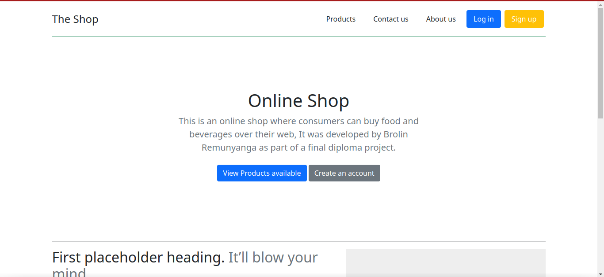
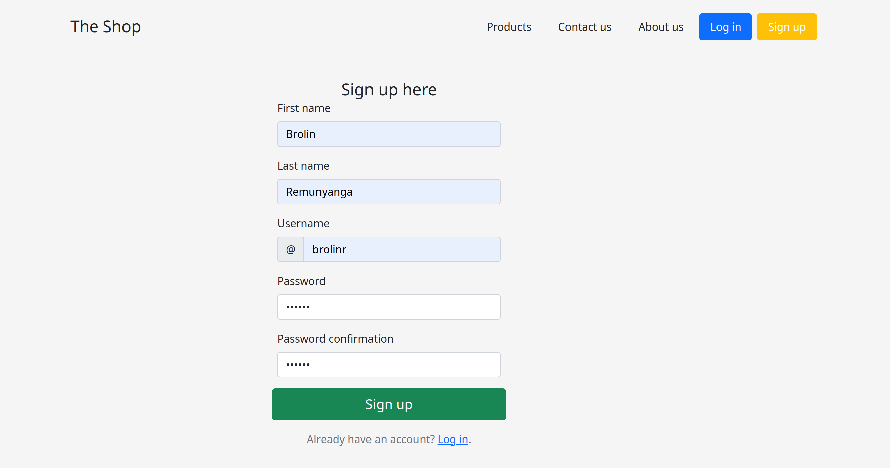
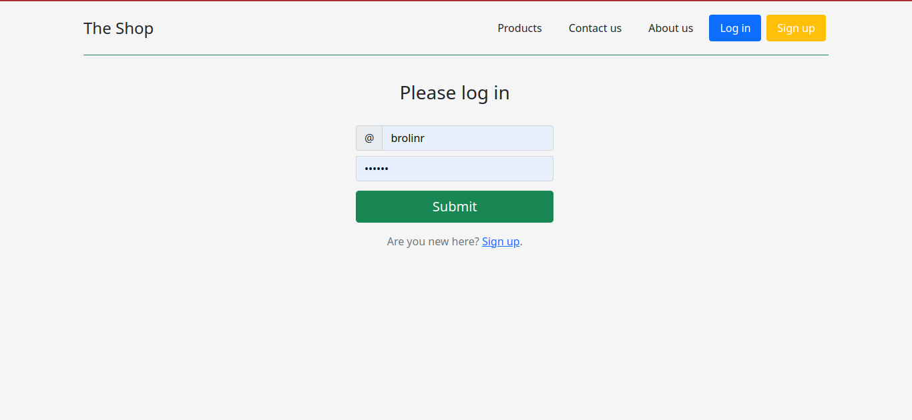
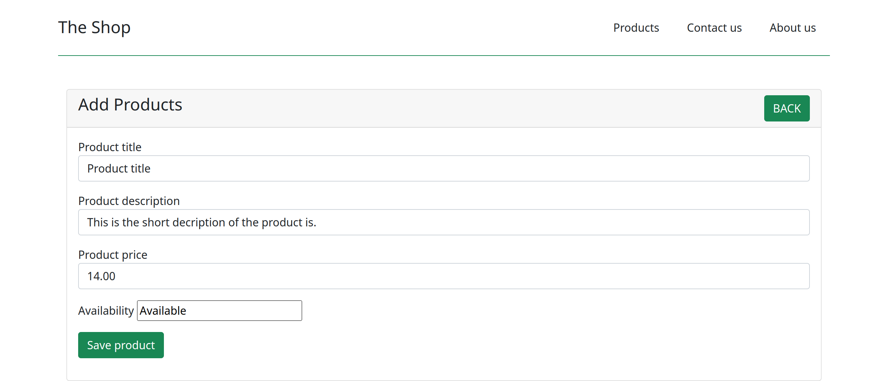
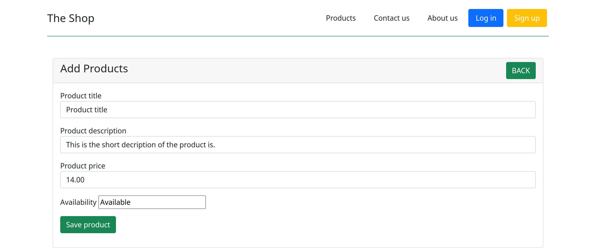
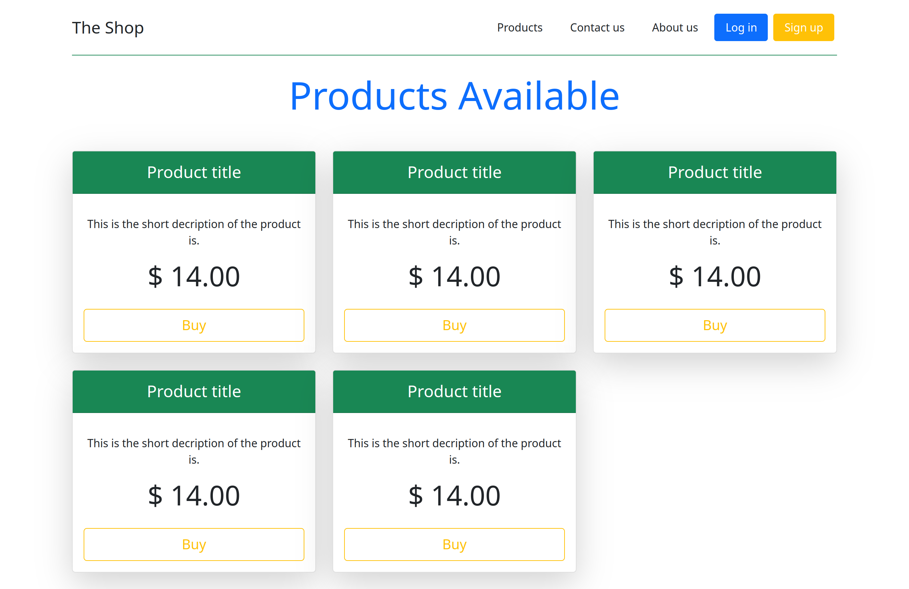
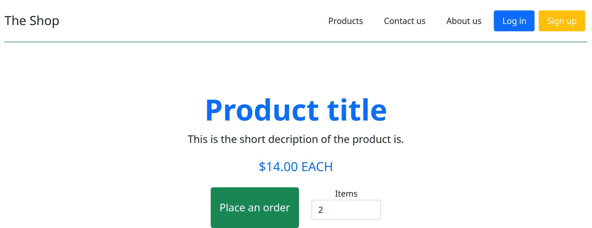
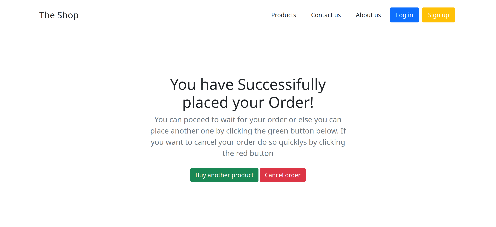
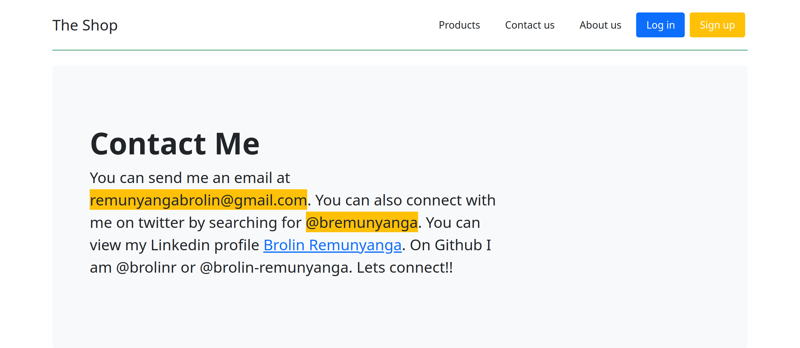
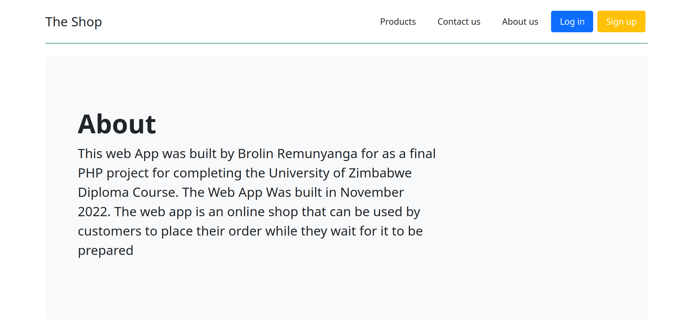

# Online shop

This is an online shop for ordering food products.

## Prerequisites

The web app requires:

* PHP
* MYSQL.
* Web browser(Google Chrome is the prefferred one).
* Xampp or Lampp

Do not worry about screen resolutions since the frontend was designed to be responsive accross multiple devices. Also make sure that the password of the root user on phpmyadmin is empty.

## Running the app

First clone the repository from github then copy the directory `the_shop` into the folder of the installation files of xampp named `/htdocs`. A database for the app has to be setup by visiting phpmyadmin and creating a new database called `onlineShop` then two tables first the products table which has the attributes title, description price and availability all of them being VARCHAR(255) except for price which has to be int(11) then lastly add the users id as a primary id which is auto incremented. The second table called users also has 5 attributes which are first_name, last_name, username and password all of them have a data type varchar(255). If xampp was already running click restart all servers. After that paste the following link into your browser <http://localhost/the_shop>. The page should display contents as below:



## Functions

In summary the app has two resources the users and the products.

### Users

The users are the customers. With an account users acan be able to buy as regular customers, although it is possible to buy products without an account. The new users should sign up and the ones with accounts should login.

#### **Signup**

On visiting the signup page which can be accessed on the nav bar of the home page. PLease note users cannot have the same username hence a unique username is required for each user. The signup page should display contents similar to:



#### **Login**

Once a user has an account they can log in upon visiting the site by clicking the login button on the home page. On log in the user enters their username and password as the image below shows:



### Products

The products resource represents the items that the shop sells. A product has a title, price, description and a status of whether not its available. To create a product the admin visits <http://localhost/PHP/products/product_new.php> which displays:



If the admin wishes to update a product's attributes they visit <http://localhost/PHP/products/product_update?id=**.php>. The asterisks represent the id of the product the admin wishes to update. Upon visiting the update page of a product the page displays contents as below:



To view all items the user goes to <http://localhost/PHP/products/products_index.php> which displays all the products available as the image below shows:



While browsing the products the user can click the buy button of the product they wish to order. The user can also enter the amount of items of the product they wish to order.On clicking the button they should be directed to order the product on a screen that looks like this:



When the user clicks the green 'place an order' button they are directed to a page that confirms that they have placed the order. The page allows the user to buy another product or cancel an order they have made. If the user has done placing an order they can wait fr the order's preparation and delivery to them.



### Static Pages

There are other pages on the web app such as the contact and about page. The contact pae displays the information below:



And the About page shows:


## Credits

* Developed by: Brolin Remunyanga.
* Credits go out to ```Mr G. Papaya``` who taught me the concepts applied in developing the application.